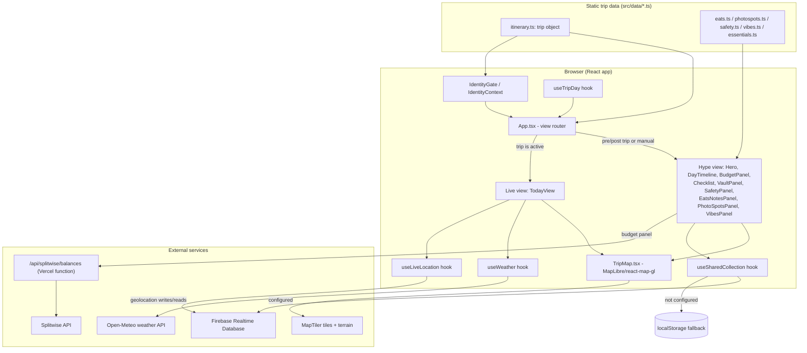

# Western Roadtrip 2026

<p align="center">
  
</p>


Private, installable trip companion for a specific drive (Minneapolis → the Mountain West → Los Angeles): interactive map, day-by-day itinerary, budget, checklist, and live crew location.

| | |
| --- | --- |
| **Author** | [Rahil Sheth](https://github.com/rsheth8) |
| **Live** | [roadtrip-interactive-map.vercel.app](https://roadtrip-interactive-map.vercel.app) |
| **Stack** | React, TypeScript, MapTiler, Vite, Vercel |
| **Status** | Personal trip companion for July 31 – August 11, 2026. Not a generic SaaS template. |

## What this is

## What this is

This is a custom, single-trip website built for a small group of friends driving from Minneapolis to Los Angeles in summer 2026. It's not a generic trip-planning product — the itinerary, crew names, dates, and budget are hardcoded for this specific trip. Anyone with the link can open it on their phone (it installs like an app via PWA support), pick who they are from the crew list, and then use it to:

- See the full route and daily stops on an interactive 3D map
- Follow a day-by-day timeline of stops, hikes, viewpoints, food, and lodging
- Track a shared budget and (optionally) live Splitwise balances
- Check off shared prep tasks (permits, bookings, packing)
- Log gas fill-ups, save notes/photos/links to a shared "vault," and view safety info
- Share live location with the rest of the crew while the trip is happening
- Get a simplified "Today" view once the trip is underway that shows just the current day, weather, and live crew map

The app has two main modes: a marketing/hype landing page used before the trip (full itinerary, budget, checklist, etc.), and a stripped-down "live" view that becomes the default once the trip's dates are underway.

## Key features

- **Interactive route map** (`src/components/TripMap.tsx`) — a MapLibre GL map (via `react-map-gl`) with 3D terrain, a glowing route line, and stop markers colored by type (city, park, hike, viewpoint, food, hotel, drive). Toggle between "this day's stops" and "all stops."
- **Day-by-day timeline** (`DayTimeline.tsx`, `DayCard.tsx`) — one card per trip day with route summary, stops, lodging, and drive time, driven entirely by the `trip` data object.
- **Auto-detected trip phase** (`useTripDay` hook) — computes days-until-departure, whether the trip is currently active, and which day number "today" is, purely from the trip's start/end dates and the current clock. The app automatically switches to the "live" Today view once the trip starts.
- **Crew identity gate** (`IdentityContext`, `IdentityGate.tsx`) — on first load each session, a visitor picks their name from the crew list (or continues as a guest). This name is used to label shared data (location pings, gas log entries, notes) without any real authentication.
- **Live location sharing** (`useLiveLocation` hook, `LiveLocationPanel.tsx`) — with consent, a crew member's browser geolocation is pushed to Firebase Realtime Database and the other crew members see live pins on the map.
- **Shared, realtime-synced collections** (`useSharedCollection` hook) — a generic hook used by the budget/gas log, checklist, vault (notes/links), and eats/notes panels. When Firebase is configured it syncs live across everyone's devices; when it isn't configured, it transparently falls back to per-browser `localStorage` so the app still works standalone.
- **Budget tracking** (`BudgetPanel.tsx`) — shows the trip's planned budget (stays/food/gas/extras) and, if a serverless Splitwise proxy is configured, live per-person balances pulled from a real Splitwise group.
- **Gas log** (`GasLog.tsx`, `useGasLog.ts`) — crew logs fuel stops/costs, shared via the same realtime collection mechanism.
- **Checklist** (`Checklist.tsx`) — shared, checkable prep tasks (permits, bookings, packing), seeded from hardcoded data in `src/data/itinerary.ts`.
- **Weather widget** (`WeatherWidget.tsx`, `useWeather` hook, `src/lib/weather.ts`) — fetches current conditions for the active day's location from the free Open-Meteo API, refreshed every 30 minutes, and cached offline via a PWA runtime-caching rule.
- **Photo spots, vibes, eats/notes, safety panels** — additional informational panels (`PhotoSpotsPanel.tsx`, `VibesPanel.tsx`, `EatsNotesPanel.tsx`, `SafetyPanel.tsx`) rendering curated/hardcoded content from `src/data/*.ts`.
- **Installable PWA** — configured via `vite-plugin-pwa` with a manifest, offline asset caching, and an in-app install prompt (`InstallPrompt.tsx`, `useInstallPrompt.ts`).
- **Mobile-first navigation** — a bottom `MobileNav` on small screens and a top `Nav` bar with a toggle between the full "Trip" view and the "Live/Today" view.

## How it works

1. **Static trip data is the source of truth.** `src/data/itinerary.ts` exports a single `trip` object (title, dates, crew, budget, per-day stops with coordinates, checklist items). `src/data/eats.ts`, `photospots.ts`, `safety.ts`, `essentials.ts`, and `vibes.ts` hold other curated content. None of this is fetched from a backend — it's compiled into the app.
2. **On load**, `IdentityProvider` checks `sessionStorage`/`localStorage` for a previously chosen identity. If none exists, `IdentityGate` is shown so the visitor picks their name (or "guest") from `trip.crew`.
3. **`useTripDay`** compares the current date/time to `trip.startDate`/`trip.endDate` to decide whether the trip is upcoming, active, or over, and which day number is "today."
4. **`App.tsx`** picks a view based on trip phase (or a manual toggle in the nav bar):
   - **Hype mode** (pre-trip / manual): renders `Hero`, `DayTimeline` (backed by `TripMap` for the route/markers), `BudgetPanel`, `Checklist`, `VaultPanel`, `SafetyPanel`, `EatsNotesPanel`, `PhotoSpotsPanel`, `VibesPanel`, and `Footer`.
   - **Live mode** (during the trip): renders `TodayView`, a focused single-day view combining the map, weather, and live crew locations.
5. **The map** (`TripMap.tsx`) uses `react-map-gl`/MapLibre GL with a MapTiler-hosted style and terrain-RGB tiles (requires `VITE_MAPTILER_KEY`; the component renders a "map requires a key" placeholder if it's missing/invalid). It draws the full driving route as a GeoJSON line and stop markers for either the active day or the whole trip, computed client-side from `trip.days`.
6. **Shared/interactive data** (budget notes, gas log entries, checklist state, vault items) all go through the `useSharedCollection` hook, which:
   - If Firebase env vars are set (`VITE_FIREBASE_*`), reads/writes live to Firebase Realtime Database paths like `roadtrip2026/locations`, `.../bookings`, `.../notes`, `.../gas`, `.../checklist` (see `src/lib/firebase.ts`), so all crew devices stay in sync in real time.
   - If Firebase isn't configured, falls back to `localStorage` on that one device, so the app degrades gracefully to single-device use.
7. **Live location** (`useLiveLocation`) opts a crew member into sharing their browser's `navigator.geolocation` position, written to the Firebase `locations` path and displayed as live pins to everyone else — again with a `localStorage` opt-in flag and only active if Firebase is configured.
8. **Weather** (`useWeather` / `src/lib/weather.ts`) fetches from the public Open-Meteo API (no key required) for the coordinates of the active day, polling every 30 minutes.
9. **Budget balances** optionally call a Vercel serverless function, `api/splitwise/balances.ts`, which proxies a request to the Splitwise API using server-only secrets (`SPLITWISE_ACCESS_TOKEN`, `SPLITWISE_GROUP_ID`) so the token is never exposed to the browser.
10. **PWA/offline**: `vite-plugin-pwa` (configured in `vite.config.ts`) generates a manifest and service worker so the app can be installed to a home screen and pre-caches static assets plus weather API responses for short-term offline use.



## Tech stack

- **Framework**: React 19 + TypeScript, built with Vite 8
- **Styling**: Tailwind CSS 4 (via `@tailwindcss/vite`)
- **Map**: `maplibre-gl` + `react-map-gl`, tiles/terrain from MapTiler
- **Animation**: `framer-motion`
- **Realtime data**: `firebase` (Realtime Database)
- **PWA**: `vite-plugin-pwa`
- **Serverless backend**: a single Vercel function (`@vercel/node`) proxying the Splitwise API
- **Linting**: `oxlint`
- **Deployment**: Vercel (`vercel.json`)

## Project structure

```
api/splitwise/balances.ts   Vercel serverless function proxying Splitwise balances
src/
  App.tsx                   Top-level view router (hype vs. live) and identity gate
  main.tsx                  React entry point
  context/IdentityContext.tsx   Crew identity ("who is using this session")
  hooks/                     One hook per feature: trip day, weather, gas log,
                             live location, shared Firebase/localStorage collections,
                             install prompt, Splitwise balances
  lib/
    firebase.ts              Firebase app/database init + realtime DB paths
    weather.ts                Open-Meteo fetch helper
  data/                      Hardcoded trip content: itinerary, eats, photo spots,
                             safety info, packing essentials, "vibes"
  components/                 UI: Hero, Nav/MobileNav, DayTimeline/DayCard,
                             TripMap, BudgetPanel, Checklist, VaultPanel,
                             SafetyPanel, EatsNotesPanel, PhotoSpotsPanel,
                             VibesPanel, GasLog, LiveLocationPanel, TodayView,
                             SplitwisePanel, WeatherWidget, Countdown,
                             IdentityGate, InstallPrompt, Footer
  types/                      Shared TypeScript types (trip.ts, live.ts)
scripts/
  seed-firebase.mjs           Script to seed initial Firebase data
  bookings.private.example.json  Example private bookings data shape
public/                       Static assets (icons, PWA assets)
vite.config.ts                Vite + Tailwind + PWA plugin configuration
vercel.json                   Vercel deployment config
.env.example                  Documents all required/optional environment variables
```

## Setup / running locally

Requires Node.js and npm.

```bash
# install dependencies
npm install

# copy the environment template and fill in values
cp .env.example .env

# start the dev server
npm run dev

# type-check and build for production
npm run build

# preview a production build locally
npm run preview

# lint
npm run lint
```

Environment variables (see `.env.example`):

- `VITE_MAPTILER_KEY` — required for the map to render; get a free key from MapTiler.
- `VITE_FIREBASE_API_KEY`, `VITE_FIREBASE_AUTH_DOMAIN`, `VITE_FIREBASE_DATABASE_URL`, `VITE_FIREBASE_PROJECT_ID` — required for live crew location sharing and cross-device sync of budget/checklist/vault/gas data; without them the app falls back to local-only storage.
- `VITE_SPLITWISE_GROUP_URL` — optional link to the crew's Splitwise group.
- `SPLITWISE_ACCESS_TOKEN`, `SPLITWISE_GROUP_ID` — server-only (set in the Vercel dashboard, not prefixed with `VITE_`), used by `api/splitwise/balances.ts` to show live balances.

## Notable implementation details / design decisions

- **No real authentication.** The crew "identity" system is a simple named-picker stored in `sessionStorage`/`localStorage` — it labels who did what (e.g., who logged a gas fill-up) but doesn't gate access; anyone with the link can pick any name or continue as a guest.
- **Graceful degradation without Firebase.** Every feature that would normally sync live across devices (`useSharedCollection`, `useLiveLocation`) checks `isFirebaseConfigured()` first and transparently falls back to `localStorage`, so the app is fully usable standalone (e.g., for local development) without any backend credentials.
- **Undefined-value stripping for Firebase writes.** `useSharedCollection` strips `undefined` properties before writing to Firebase, since the Realtime Database SDK throws synchronously on `undefined` values — this lets calling code use the common `field: x || undefined` pattern for optional fields.
- **Auto view-switching based on real dates.** `useTripDay` derives trip phase purely from `trip.startDate`/`trip.endDate` vs. the current date, so the app automatically flips from the pre-trip "hype" landing page to the stripped-down "live" Today view once the trip starts, without any manual flag — though users can still override the view manually via the nav toggle.
- **Splitwise token never reaches the browser.** Live balances are fetched through a Vercel serverless function (`api/splitwise/balances.ts`) that holds the Splitwise API token server-side; the frontend only calls the app's own `/api/splitwise/balances` endpoint.
- **Offline-friendly weather caching.** The PWA's Workbox config (`vite.config.ts`) adds a `NetworkFirst` runtime caching rule specifically for Open-Meteo API responses, so recent weather data remains available briefly offline.
- **All trip content is hardcoded, not user-editable through a CMS/admin UI.** Updating the itinerary, budget, or checklist means editing the TypeScript files in `src/data/`.

## Contributing

PRs and issues welcome. How to run tests, env vars, and the expected layout: [CONTRIBUTING.md](CONTRIBUTING.md).

Don't commit `.env`, API keys, or personal recordings.

