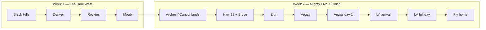
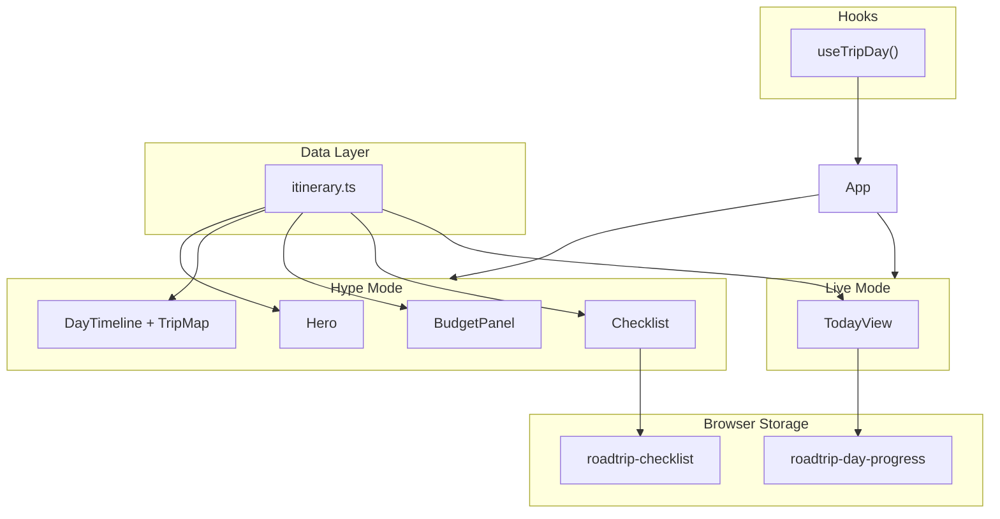

# Western Roadtrip 2026 — Interactive Map

A cinematic, mobile-friendly roadtrip hub for a **12-day summer adventure** from Minneapolis through the mountain west to Los Angeles. Built as a single-page React app that works as both a **pre-trip hype page** (countdown, full itinerary, budget, prep checklist) and a **live trip companion** (today's plan, navigation links, stop checkboxes) once you're on the road.

**Trip dates:** July 31 – August 11, 2026  
**Route:** ~2,400 miles · Minneapolis → Black Hills → Denver → Moab → Utah's Mighty Five → Las Vegas → Los Angeles  
**Crew:** Rahil, Sriram, Rishabh, and Nilay — **4 travelers through Denver, then 3 to LA**

---

## Table of contents

- [The crew](#the-crew)
- [Trip arc at a glance](#trip-arc-at-a-glance)
- [Full day-by-day itinerary](#full-day-by-day-itinerary)
- [Lodging plan](#lodging-plan)
- [Budget](#budget)
- [Book before you leave](#book-before-you-leave)
- [Packing essentials](#packing-essentials)
- [One-page cheat sheet](#one-page-cheat-sheet)
- [Website features](#website-features)
- [Live trip mode](#live-trip-mode)
- [Quick start](#quick-start)
- [MapTiler setup](#maptiler-setup)
- [Customize the trip](#customize-the-trip)
- [Project structure](#project-structure)
- [Architecture](#architecture)
- [Design system](#design-system)
- [Deploy to Vercel](#deploy-to-vercel)
- [Scripts](#scripts)
- [Future ideas](#future-ideas)

---

## The crew

| Name | Role | Stays through |
|------|------|---------------|
| **Rahil** | Full trip | LA (Aug 11) |
| **Sriram** | Full trip | LA (Aug 11) |
| **Rishabh** | Full trip | LA (Aug 11) |
| **Nilay** | First leg only | Denver (flies home morning of Day 4, Aug 3) |

After Nilay departs from **Denver International (DIA)** on Day 4, Rahil, Sriram, and Rishabh continue west through Utah's national parks, Vegas, and LA.

The website reflects this split everywhere it matters: hero tags, map footer traveler counts, budget math, Day 4 stops, and the prep checklist.

---

## Trip arc at a glance



| Phase | Days | Energy | Theme |
|-------|------|--------|-------|
| **The haul** | 1–2 | High drive, low hike | Cross the plains into the Rockies |
| **Alpine day** | 3 | Early start, big views | Rocky Mountain NP — Trail Ridge Road |
| **Transition** | 4 | Easy recovery | Nilay flies home; trio heads to Moab |
| **Desert parks** | 5–7 | Hardest hiking | Arches, Canyonlands, Hwy 12, Bryce, Zion |
| **Fun mode** | 8–9 | Low drive, high vibes | Las Vegas — two full nights |
| **Coast finish** | 10–12 | Scenic + culture | Mojave stop, LA exploration, fly home |

**Vibe:** Hit the highlights hard, but build in one easy window per day so nobody melts down. Balanced-aggressive pacing — not a relaxed vacation, not a death march.

---

## Full day-by-day itinerary

### Day 1 — Fri Jul 31 · Minneapolis → Black Hills

**Route:** Minneapolis → Needles Hwy → Iron Mountain Rd → Mt. Rushmore → Rapid City  
**Drive:** ~580 mi · ~9 hrs · **Leave by 6 AM**  
**Lodging:** Rapid City area (≈ $100)

| Time | Stop | Notes |
|------|------|-------|
| 6:00 AM | Depart Minneapolis | I-90 West → US-16 West into the Black Hills |
| 2:00–3:00 PM | Needles Highway | Needles Eye Tunnel — enter Custer State Park |
| 3:00–3:45 PM | Iron Mountain Road | Pigtail bridges + tunnel frames of Rushmore |
| 4:00–5:30 PM | Mount Rushmore | Presidential Trail loop, Avenue of Flags |
| 5:30–6:30 PM | Sylvan Lake (optional) | Golden-hour photos — skip if behind |
| Alt. | Wildlife Loop Road (optional) | Bison herds — only if ahead of schedule |
| Night | Rapid City lodging | Early bed — big drive tomorrow |

**Balance move:** Scenic drives before Rushmore for the iconic tunnel views. Skip Sylvan Lake if behind.

**Highlight:** Granite faces, needle spires, and your first western sunset.

---

### Day 2 — Sat Aug 1 · Black Hills → Denver

**Route:** Rapid City → Cheyenne → Denver  
**Drive:** ~375 mi · ~6.5 hrs · **Leave by 8 AM (no sunrise)**  
**Lodging:** Denver area (≈ $300 for 2 nights)

| Time | Stop | Notes |
|------|------|-------|
| 8:00 AM | Depart Rapid City | No Black Hills sunrise — save energy for RMNP |
| 10:00–10:20 AM | Wall Drug (optional) | Quick photo stop — 15 min max |
| 12:00–1:00 PM | Cheyenne, WY | Lunch + gas break |
| 6:00 PM | Denver check-in | Easy dinner, short LoDo walk |
| Evening | Low-key | **No big night out** — Rocky Mountain NP tomorrow |

**Why we changed the original plan:** Black Hills sunrise + Denver same day = 8+ hrs driving on no sleep.

**Highlight:** Long haul west — skip sunrise, save energy for the Rockies tomorrow.

---

### Day 3 — Sun Aug 2 · Rocky Mountain National Park

**Route:** Denver → RMNP day trip → Denver  
**Drive:** ~70 mi round trip · **Start at 5:30 AM**  
**Lodging:** Same Denver hotel

| Time | Stop | Notes |
|------|------|-------|
| 5:30 AM | Depart Denver | **Timed entry reservation required** |
| 6:30–8:00 AM | Bear Lake Trailhead | Bear Lake loop or Nymph Lake extension |
| 8:00–11:00 AM | Trail Ridge Road | Rock Cut, Forest Canyon Overlook, Alpine Visitor Center |
| 9:00–10:00 AM | Rock Cut & Forest Canyon Overlook | Must-see alpine tundra views |
| 11:30 AM–12:30 PM | Estes Park lunch | |
| 1:00–4:00 PM | RMNP afternoon hike (optional) | Alberta Falls or Sprague Lake — cut if tired |
| 8:00 PM–12:00 AM | Denver nightlife (optional) | LoDo / RiNo — skip if wiped from Trail Ridge |

**Balance move:** Trail Ridge Road is non-negotiable. Second hike and nightlife are bonus.

**Highlight:** Trail Ridge Road — alpine tundra above the treeline.

---

### Day 4 — Mon Aug 3 · Denver → Moab

**Route:** Denver → I-70 West → Moab, UT  
**Drive:** ~350 mi · ~6 hrs  
**Lodging:** Moab area (≈ $260 for 2 nights)  
**Travelers:** 4 → **3** after morning

| Time | Stop | Notes |
|------|------|-------|
| 8:00 AM | **DIA — Nilay flies home** | Drop at Denver International |
| 9:30–11:00 AM | Brunch in Denver | Last meal as a quartet |
| 11:30 AM–2:00 PM | I-70 West through the Rockies | Eisenhower Tunnel, Glenwood Canyon |
| 3:00–3:30 PM | Green River, UT | Gas + snacks |
| 6:00 PM | Moab check-in | Walk Main Street, pack daypacks for Arches sunrise |

**Balance move:** Intentionally easy — recovery day before the hardest park day.

**Highlight:** Nilay flies home from Denver — the three of us head to Moab.

---

### Day 5 — Tue Aug 4 · Arches & Canyonlands

**Route:** Arches sunrise → Delicate Arch → Canyonlands Island in the Sky  
**Drive:** ~40 mi between parks  
**Lodging:** Same Moab hotel  
**Travelers:** 3

| Time | Stop | Notes |
|------|------|-------|
| 5:15 AM | Arches NP entry | Arrive early — parking fills fast |
| 5:45–8:15 AM | **Delicate Arch Trail** | Do FIRST — 3 mi RT, zero shade, 3L+ water each |
| 8:30–10:30 AM | Landscape Arch Trail | Devils Garden — skip Double O if tired |
| 11:00 AM–12:00 PM | Lunch in Moab | |
| 12:30–4:30 PM | Canyonlands NP — Island in the Sky | Grand View Point, Green River Overlook |
| 3:15–4:00 PM | Mesa Arch (optional) | Skip if running late |
| 4:30–5:30 PM | **Dead Horse Point SP** | Iconic river bend — $20, not on NPS pass |
| 6:30–8:00 PM | Dinner in Moab | Early bed |

**Balance move:** Delicate Arch before Landscape Arch (cooler). Skip Mesa Arch before Dead Horse Point if tight.

**Highlight:** Biggest park day — pre-download offline maps (crew of 3).

---

### Day 6 — Wed Aug 5 · Capitol Reef → Hwy 12 → Bryce → Springdale

**Route:** Moab → Capitol Reef → Utah Hwy 12 → Bryce → Springdale  
**Drive:** ~220 mi · ~5 hrs driving + stops  
**Lodging:** Springdale / Zion area (≈ $140 for 2 nights)

| Time | Stop | Notes |
|------|------|-------|
| 6:00 AM | Depart Moab | |
| 8:30–10:30 AM | Capitol Reef NP | Scenic drive through the park |
| 10:00–10:30 AM | Goosenecks Overlook | |
| 10:30–11:00 AM | Petroglyph Panel | Fremont culture rock art along Hwy 24 |
| 11:00 AM–12:00 PM | Fruita — Gifford House | Famous peach pie — seasonal in August! |
| 12:00–3:00 PM | **Utah Scenic Byway 12** | Boulder → Escalante → Red Canyon. Don't rush. |
| 2:30–3:00 PM | Red Canyon — Dixie NF | Hoodoos right off the highway |
| 4:00–4:45 PM | Bryce Canyon — Sunset Point | |
| 4:45–5:30 PM | Bryce Canyon — Inspiration Point | |
| 5:30–8:35 PM | Bryce Canyon — Bryce Point | **Real sunset ~8:35 PM MDT** |
| Alt. | Navajo Loop + Queens Garden | Hike INTO the amphitheater instead of extra rim time |
| Night | Springdale lodging | ~1.5 hr from Bryce — expect ~10 PM arrival |

**Balance move:** Hwy 12 is the priority — don't rush it for extra Capitol Reef time.

**Highlight:** Scenic crown jewel — Utah Highway 12 is the best drive of the trip.

---

### Day 7 — Thu Aug 6 · Zion National Park

**Route:** Springdale → Zion full day  
**Drive:** ~0.5 hr (shuttle / short drives)  
**Lodging:** Same Springdale hotel

| Time | Stop | Notes |
|------|------|-------|
| 5:00 AM | Enter Zion | Shuttle or early parking — check NPS alerts |
| 6:30 AM–11:00 AM | **Angels Landing** (permit required) | Chain section at top; Scout Lookout = turnaround without chains |
| Alt. morning | Observation Point (Plan B) | East Mesa Trail if no Angels permit |
| 11:00 AM–12:30 PM | Lunch in Springdale | |
| 12:30–2:00 PM | Riverside Walk | Easy, flat, shady — Gateway to the Narrows |
| 2:00–4:00 PM | Emerald Pools Trail | Moderate |
| Alt. afternoon | The Narrows (optional) | River hike — check flash flood forecast, rent water shoes |

**Balance move:** Morning = the hard hike. Afternoon = pick ONE of Riverside / Emerald / Narrows.

**Highlight:** Angels Landing permit day — lottery hike + canyon floor trails.

---

### Day 8 — Fri Aug 7 · Springdale → Las Vegas

**Route:** Zion area → Las Vegas Strip  
**Drive:** ~160 mi · ~2.5 hrs  
**Lodging:** Las Vegas area (≈ $200 for 2 nights)

| Time | Stop | Notes |
|------|------|-------|
| 9:00 AM | Depart Springdale | Sleep in — breakfast in town |
| 11:30 AM–1:30 PM | **Valley of Fire SP** | Fire Wave, petroglyphs — detour off I-15 |
| 1:30–2:30 PM | Drive to Las Vegas | |
| 3:00–4:30 PM | Vegas check-in & pool | |
| 4:00–6:00 PM | Bellagio Fountains & Strip walk | |
| 6:00–7:30 PM | Fremont Street Experience | Old Vegas — light show canopy |
| 8:00 PM–12:00 AM | Night out | Dinner + casinos — **set a gambling budget!** |

**Highlight:** Desert to neon — first Vegas night on the Strip.

---

### Day 9 — Sat Aug 8 · Las Vegas — full day

**Route:** Vegas pool, explore & night 2  
**Drive:** Minimal  
**Lodging:** Same Vegas hotel

| Time | Stop | Notes |
|------|------|-------|
| 10:00 AM–12:00 PM | Brunch on the Strip | |
| 12:00–3:00 PM | Pool / rest at hotel | |
| 3:00–5:30 PM | Red Rock Canyon (optional) | 13-mile scenic loop, 30 min from Strip |
| Afternoon | Explore the Strip | Caesars, Venetian, High Roller |
| 7:00 PM–12:00 AM | Night 2 out | Show or clubs — pack for LA drive tomorrow |

**Why 2 Vegas nights:** Earned after Zion/Arches. Also splits the Vegas→LA drive.

**Highlight:** Recovery day — pool, optional Red Rock, second night out.

---

### Day 10 — Sun Aug 9 · Las Vegas → Los Angeles

**Route:** Vegas → Mojave NP → Santa Monica  
**Drive:** ~270 mi · ~6 hrs + Mojave stop  
**Lodging:** Rahil's friend's new apt (free, 2 nights)

| Time | Stop | Notes |
|------|------|-------|
| 9:00 AM | Depart Las Vegas | |
| 9:15–9:35 AM | Seven Magic Mountains (optional) | Quick photo stop south of Vegas |
| 11:30 AM–1:30 PM | Mojave National Preserve | Kelso Dunes — climb for vast desert views |
| 12:00–1:30 PM | Kelso Dunes hike | 3 mi RT sand hike — bring water |
| 5:30 PM | Friend's apt — check in | Drop bags, quick refresh |
| 6:00–8:30 PM | Santa Monica Pier & Beach | Pier sunset ~7:45 PM PDT, dinner on west side |

**Anchor pick:** One LA neighborhood per day beats trying to "see all of LA."

**Highlight:** Desert dunes stop, then coast — Santa Monica Pier at sunset.

---

### Day 11 — Mon Aug 10 · Los Angeles — full day

**Route:** Griffith Observatory → beaches & neighborhoods  
**Drive:** ~1 hr local  
**Lodging:** Same — Rahil's friend's apt

| Time | Stop | Notes |
|------|------|-------|
| 9:00–10:30 AM | Breakfast | Koreatown cafes or Abbot Kinney stroll |
| 11:00 AM–1:00 PM | Griffith Observatory | Free admission, Hollywood sign views, city panorama |
| 1:00–2:30 PM | Lunch | Los Feliz or Thai Town |
| 3:00–5:00 PM | Getty Center (optional) | Free museum — reserve timed entry |
| 3:00–5:00 PM | Venice Beach Boardwalk (optional) | Pick Getty OR Venice — not both |
| 7:00–9:30 PM | Final group dinner | Book somewhere worth dressing up for |

**Highlight:** Iconic LA views, food crawl, final group dinner.

---

### Day 12 — Tue Aug 11 · Fly home from LA

**Route:** LAX → home  
**Drive:** ~1 hr to airport

| Time | Stop | Notes |
|------|------|-------|
| 8:00–9:30 AM | Easy breakfast near lodging | |
| 10:00–11:00 AM | Return rental car | Allow buffer for LAX traffic |
| Midday+ | **LAX — fly home** | Book afternoon flights so nobody's rushing |

**Highlight:** Easy morning — return car, fly out midday+.

---

## Lodging plan

| Nights | Dates | Location | Status | Est. cost |
|--------|-------|----------|--------|-----------|
| 1 | Jul 31 | Rapid City | TBD | ≈ $100 |
| 2–3 | Aug 1–2 | Denver (2 nights) | TBD | ≈ $300 |
| 4–5 | Aug 3–4 | Moab (2 nights) | TBD | ≈ $260 |
| 6–7 | Aug 5–6 | Springdale / Zion (2 nights) | TBD | ≈ $140 |
| 8–9 | Aug 7–8 | Las Vegas (2 nights) | TBD | ≈ $200 |
| 10–11 | Aug 9–10 | Los Angeles — Rahil's friend's apt | Confirmed | **Free** |

**Total:** 9 paid nights · ≈ $925 (LA lodging covered — saves ≈ $275)

---

## Budget

Shared trip costs, split by days traveled and traveler count.

| Category | Total | Notes |
|----------|-------|-------|
| **Lodging** | $925 | 9 nights booked — LA stay is free at Rahil's friend's apt |
| **Food & drinks** | $1,800 | ≈ $50/day/person · 4 through Denver, then 3 to LA |
| **Gas** | $400 | ~2,400 mi — 4-way split days 1–4, then 3-way |
| **Permits & extras** | $150 | Park fees, lottery permits, Vegas buffer |
| **Total (shared)** | **$3,275** | |

### Per-person estimates

| Who | Estimate | Calculation |
|-----|----------|-------------|
| **Rahil, Sriram & Rishabh** | **≈ $1,001 each** | 4-way share for days 1–4, then 3-way for days 5–12 |
| **Nilay** | **≈ $273** | 4-way share for days 1–4 only |

Budget math lives in [`src/data/itinerary.ts`](src/data/itinerary.ts) via `getTotalPerPerson()` and `getMemberTripCost()`. Update `trip.budget` and the site recalculates automatically.

---

## Book before you leave

| What | When | Link |
|------|------|------|
| **America the Beautiful pass** | Before trip | Covers RMNP, Arches, Canyonlands, Bryce, Zion ($80) |
| **Angels Landing permit** | Apr 2026 seasonal lottery + day-before backup at 1 PM MT | [recreation.gov](https://www.recreation.gov/permits/4675310) |
| **Rocky Mountain NP timed entry** | ~60 days before Aug 2 | [recreation.gov timed entry](https://www.recreation.gov/timed-entry/100869) |
| **Arches timed entry** (if required Aug 2026) | ~60 days before Aug 4 | Check [NPS Arches alerts](https://www.nps.gov/arch/) |
| **Zion shuttle / parking** | Week before trip | [nps.gov/zion](https://www.nps.gov/zion/) |
| **Nilay's DEN flight** | ASAP | Morning of Day 4 (Aug 3) |
| **LAX flights home** | ASAP | Midday+ on Aug 11 |
| **All hotels** | ASAP | Moab + Springdale peak season books early |
| **Car rental** | ASAP | One-way drop-off at LAX |

**Plan B hikes if Angels Landing lottery fails:** Scout Lookout (no chain section), Observation Point via East Mesa Trail, or The Narrows (if water levels OK).

The website checklist (`#checklist`) tracks all of this with localStorage persistence.

---

## Packing essentials

- **2L+ water bottles** per person (non-negotiable for Arches / Delicate Arch)
- Hiking boots broken in before the trip
- Sunscreen SPF 50, hats, sunglasses, electrolytes
- **Layers:** RMNP mornings can be 40°F; Moab afternoons 100°F+
- Headlamps (early Arches / Zion starts)
- Portable charger (long driving days)
- Small cooler for road snacks + drinks
- Download **offline Google Maps** for UT / AZ / NV / CA
- Zion Narrows: water shoes + dry bag (if doing the river hike)
- Oil change, tire check, spare tire & jack before departure

---

## One-page cheat sheet

| Day | Date | Sleep in | Must-do |
|-----|------|----------|---------|
| 1 | Jul 31 | Rapid City | Needles → Iron Mtn → Rushmore |
| 2 | Aug 1 | Denver | Just get to Denver |
| 3 | Aug 2 | Denver | Trail Ridge Road |
| 4 | Aug 3 | Moab | Nilay → DIA; trio drives to Moab |
| 5 | Aug 4 | Moab | Delicate Arch → Canyonlands → Dead Horse |
| 6 | Aug 5 | Springdale | Hwy 12 + Bryce sunset (~8:35 PM) |
| 7 | Aug 6 | Springdale | Angels Landing (or Plan B) |
| 8 | Aug 7 | Vegas | Valley of Fire + Strip |
| 9 | Aug 8 | Vegas | Pool + night out |
| 10 | Aug 9 | Friend's apt | Mojave stop + Santa Monica |
| 11 | Aug 10 | Friend's apt | Griffith + one neighborhood |
| 12 | Aug 11 | — | Fly home from LAX |

---

## Website features

### Hype mode (pre-trip & full itinerary)

The default view before and during the trip (toggle with **Today / Full trip** in the nav).

| Section | What it does |
|---------|--------------|
| **Hero** | Trip title, dates, countdown to Jul 31, crew tags, "Explore the route" CTA |
| **Route + map** | MapTiler 3D terrain map with route polyline. Pick a day → map flies there. Toggle **This day** / **All stops** |
| **Day picker** | Horizontal tabs for all 12 days |
| **Day cards** | Expandable accordion with every stop, time, notes, and links (Maps, AllTrails, NPS) |
| **Budget** | Animated per-person totals with 4→3 split |
| **Checklist** | Permits, bookings, packing — saved in browser localStorage |
| **Mobile nav** | Bottom tab bar on phone (Home, Route, Days, Budget, Prep) |

### Map controls

- **This day** — shows only the active day's stops; map flies to that day's center
- **All stops** — zooms out to fit the entire route; every stop from all 12 days
- **Orange line** — full driving route Minneapolis → LA
- **Colored dots** — stop type (city, park, hike, viewpoint, food, hotel, drive)

| Color | Stop type |
|-------|-----------|
| Green | Cities |
| Orange | Parks |
| Peach | Hikes |
| Light green | Viewpoints |
| Purple | Food |
| Blue | Hotels |
| Gray | Drives |

---

## Live trip mode

After **July 31, 2026**, the site auto-opens **Today** view on load. Use the **Today / Full trip** toggle in the nav to switch anytime.

### What live mode shows

- Current day number, date, title, and highlight
- Progress bar (stops completed / total)
- **Navigate to next** — big button linking to Google Maps for the next unchecked stop
- Tonight's lodging
- Full stop list with checkboxes (saved in `localStorage` under `roadtrip-day-progress`)
- Per-stop **Open in Maps** links

### Safety note

Large tap targets are designed for **passenger use only**. Don't interact with the app while driving.

### How day detection works

[`src/hooks/useTripDay.ts`](src/hooks/useTripDay.ts) compares today's date against `trip.startDate` and `trip.endDate`:

- **Pre-trip:** `isPreTrip = true`, countdown runs
- **Active:** `isTripActive = true`, `currentDay` = days since start + 1
- **Post-trip:** `isTripOver = true`, defaults back to hype mode

Updates every 60 seconds. No backend required.

---

## Quick start

```bash
# Clone / cd into the project
npm install

# Copy env template and add your MapTiler key
cp .env.example .env

# Start dev server
npm run dev
```

Open [http://localhost:5173](http://localhost:5173).

```bash
# Production build
npm run build

# Preview production build locally
npm run preview
```

---

## MapTiler setup

The map uses **MapLibre GL JS** with **MapTiler** tiles (Dataviz Dark style + 3D terrain). A free MapTiler account is required.

1. Create a free account at [cloud.maptiler.com](https://cloud.maptiler.com/)
2. Copy your API key from [Account → Keys](https://cloud.maptiler.com/account/keys/)
3. Add to `.env`:

```
VITE_MAPTILER_KEY=your_key_here
```

4. Restart `npm run dev`

The map shows a setup message if the key is missing or invalid. Free tier includes ~100k tile requests/month — plenty for a personal trip site.

> **Note:** The app originally used Mapbox. It was migrated to MapLibre + MapTiler for a generous free tier while keeping 3D terrain and fly-to animations.

---

## Customize the trip

**Everything lives in one file:** [`src/data/itinerary.ts`](src/data/itinerary.ts)

### What to edit

| Field | Purpose |
|-------|---------|
| `trip.title` / `trip.subtitle` | Hero headline |
| `trip.startDate` / `trip.endDate` | Countdown + live mode dates (`YYYY-MM-DD`) |
| `trip.crew` | Friend names; add `lastDay: N` if someone leaves early |
| `trip.budget` | `stays`, `food`, `gas`, `extras` totals |
| `trip.checklist` | Prep items with `category` and optional `urgent: true` |
| `trip.days[]` | Full itinerary — stops, times, coords, links, lodging |
| `getRouteCoordinates()` | Orange route line anchor points `[lng, lat]` |

### Adding a stop

```ts
{
  id: "d5-new-stop",        // unique ID
  name: "Delicate Arch",
  lat: 38.7355,
  lng: -109.5205,
  type: "hike",             // city | park | hike | viewpoint | food | hotel | drive
  time: "9:00 – 11:00 AM",
  notes: "Bring 2L water",
  links: {
    maps: "https://maps.google.com/?q=...",
    trail: "https://www.alltrails.com/...",
    info: "https://www.nps.gov/...",
  },
}
```

### Adding a crew member who leaves early

```ts
{ name: "Nilay", lastDay: 4 }  // inclusive — travels days 1–4, flies home morning of day 4
```

No component changes needed — budget, map footer, and hero all read from this data.

---

## Project structure

```
roadtrip-interactive-map/
├── src/
│   ├── App.tsx                 # Root layout, hype vs live mode routing
│   ├── main.tsx                # React entry point
│   ├── index.css               # Tailwind v4 theme + global styles
│   ├── data/
│   │   └── itinerary.ts        # ★ Single source of truth for the whole trip
│   ├── types/
│   │   └── trip.ts             # Trip, Day, Stop, CrewMember, Budget types
│   ├── hooks/
│   │   └── useTripDay.ts       # Date logic: currentDay, isTripActive, daysUntil
│   └── components/
│       ├── Hero.tsx            # Full-screen intro + countdown + crew tags
│       ├── Countdown.tsx       # Live countdown timer
│       ├── Nav.tsx             # Top nav + Today/Full trip toggle
│       ├── MobileNav.tsx       # Bottom tab bar (mobile hype mode)
│       ├── DayTimeline.tsx     # Map + day picker + day cards
│       ├── DayCard.tsx         # Expandable single-day card
│       ├── TripMap.tsx         # MapLibre map, route, markers, flyTo
│       ├── BudgetPanel.tsx     # Cost breakdown + per-person animation
│       ├── Checklist.tsx       # Prep checklist (localStorage)
│       ├── TodayView.tsx       # Live trip dashboard
│       └── Footer.tsx          # Crew credits
├── public/
│   └── favicon.svg
├── .env.example                # VITE_MAPTILER_KEY template
├── vercel.json                 # SPA rewrite for client-side routing
├── package.json
└── README.md                   # You are here
```

---

## Architecture



**Key design decisions:**

- **No backend** — static Vite build, all state in localStorage
- **Single data file** — itinerary drives map, timeline, budget, checklist, and live mode
- **Dual mode** — same data, different UI for planning vs. on-the-road use
- **Mobile-first** — bottom nav, large tap targets in live mode, responsive map height

---

## Design system

Dark desert-night aesthetic defined in [`src/index.css`](src/index.css):

| Token | Value | Usage |
|-------|-------|-------|
| `midnight` | `#0a0f1a` | Page background |
| `dusk` | `#141e33` | Cards, panels |
| `dusk-light` | `#1e2d4a` | Active card highlight |
| `sandstone` | `#e8a87c` | Primary accent, CTAs, route line |
| `sandstone-light` | `#f4c9a8` | Gradient highlights |
| `sage` | `#8fbc8f` | Secondary accent, progress bars |
| `font-display` | Syne | Headlines |
| `font-body` | DM Sans | Body text |

Subtle film grain overlay (`.grain`) on the page root. Framer Motion handles hero entrance animations and budget number springs.

---

## Deploy to Vercel

```bash
npm i -g vercel   # if needed
vercel
```

Set `VITE_MAPTILER_KEY` in the Vercel project **Environment Variables**.

Or connect the GitHub repo in the Vercel dashboard — `vercel.json` handles SPA rewrites automatically.

```json
{
  "rewrites": [{ "source": "/(.*)", "destination": "/index.html" }]
}
```

Share the deployed URL with the crew. Everyone's checklist and day progress saves locally in their own browser — not synced across devices.

---

## Scripts

| Command | Description |
|---------|-------------|
| `npm run dev` | Start Vite dev server (port 5173) |
| `npm run build` | TypeScript check + production build → `dist/` |
| `npm run preview` | Serve production build locally |
| `npm run lint` | Run oxlint |

---

## Future ideas

Not in v1, but the data model supports adding these later:

| Feature | Notes |
|---------|-------|
| Real-time GPS / location sharing | Would need a backend or third-party service |
| Photo gallery / trip memory book | Cloudinary or similar for uploads |
| Collaborative checklist sync | Firebase / Supabase real-time DB |
| Weather API per day | OpenWeatherMap keyed to `day.date` + center coords |
| Post-trip replay mode | Map animation of the route with photos pinned to stops |
| Offline PWA | Service worker caching the static build for spotty cell service |

---

## Original plan → what we built

This project started from a handwritten notebook itinerary (9 days, 3 travelers) and evolved through planning into the current 12-day, 4→3 traveler trip:

| Decision | Original idea | Final plan |
|----------|---------------|------------|
| Trip length | 9 days | **12 days** — added 2nd Vegas night + 2 LA days + fly-home day |
| End point | Arrive LA Day 9 | **Fly home from LAX Aug 11** |
| Day 2 | Black Hills sunrise + Denver | **Skip sunrise**, leave by 8 AM |
| Day 3 nightlife | Same day as RMNP | **Optional** — cut if exhausted |
| Crew | 3 travelers | **4 through Denver**, Nilay flies home Day 4 |
| Map provider | Mapbox | **MapLibre + MapTiler** (free tier, 3D terrain kept) |
| Map interaction | Scroll-driven flyTo | **Day picker + click cards** (smoother UX) |
| Site modes | Hype + live companion | **Both implemented** with auto-switch on trip start |

---

**Rahil · Sriram · Rishabh · Nilay**  
*Minneapolis to Los Angeles · Summer 2026*
